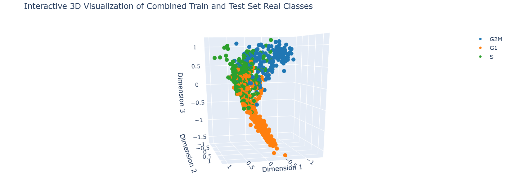

<div style="text-align: center; margin-bottom: 20px;">
    
    <hr style="border: 1px solid white; width: 80%; margin: 0 auto;" />
</div>

<p style="text-align: justify;">
    <strong>HiStrux</strong> is a Python package designed for reconstructing chromatin structures from single-cell Hi-C (scHi-C) data. 
    It integrates feature extraction, machine learning, and iterative molecular dynamics simulations to facilitate both 
    data enrichment and 3D genome modeling. The entire concept is based on:
</p>

<ul style="text-align: justify;">
    <li><strong>eXtract</strong> a variety of metrics and structural features from scHi-C maps using the <code>eXtract</code> module.</li>
    <li><strong>CycleSort</strong> cells into interphase stages with a neural network-based model (<code>CycleSort</code>) and use this information for selective data pooling.</li>
    <li><strong>reConstruct</strong> spatial chromatin organization with the <code>reConstruct</code> module, implementing iterative simulations built on top of HOOMD-blue.</li>
</ul>

<p style="text-align: justify;">
    HiStrux aims to bridge gaps between single-cell heterogeneity and richer multi-cell insights, providing an easy-to-use framework for more accurate 3D chromatin reconstructions.
</p>

## Table of Contents
- [Theory Behind HiStrux](#theory-behind-histrux)
- [Modules](#modules)
  - [`eXtract`](#extract)
  - [`reConstruct`](#reconstruct)
- [Installation Guide](#installation-guide)
- [CycleSort as a Use Case Example](#cyclesort-as-a-use-case-example)


## Theory Behind HiStrux

Single-cell Hi-C (scHi-C) data offers insights into how DNA is spatially organized within individual cells, capturing the true variability often lost when many cells are pooled together. However, scHi-C maps are typically sparse and challenging to reconstruct, given the limited number of contacts detected per cell. Traditional “bulk” methods average data from many cells, potentially obscuring distinct structural features.

**HiStrux** addresses this issue by providing:
- **eXtract** – A feature extraction module inspired by existing research. It processes raw scHi-C contact maps, performs quality checks and imputation, and then generates informative metrics. These metrics help classify cells into different interphase stages, guiding further data enrichment.
- **reConstruct** – An iterative molecular dynamics approach built upon HOOMD-blue, leveraging the cell-stage context uncovered by eXtract. This “semi-bulk” enrichment method pools only relevant contacts from similar cells, striking a balance between single-cell detail and the improved coverage seen in bulk data.

By focusing on both accurate feature extraction and more informed simulation runs, HiStrux captures critical single-cell variability while mitigating the pitfalls of sparse datasets, yielding more robust 3D chromatin reconstructions.

<div style="text-align: center; margin-bottom: 20px;">
    <hr style="border: 1px solid white; width: 80%; margin: 0 auto;" />
</div>

## Modules

<p style="text-align: justify;">
</p>

### Description:
**eXtract** is a module inspired by the CIRCLET methodology for preprocessing and feature extraction from scHi-C maps.

### Key Features:
- Processing raw data (contact matrix generation, binning, filtering).
- Imputation of missing values in the contact matrix.
- Extraction of global features as percentage of trans-interactions, contact lengths.
- Calculation of metrics as insulation score, TAD boundaries, A/B compartment division.
- Visualization of processed matrices and selected statistics (facilitates parameter tuning and quality control).

### Applications:
- Quickly generates a feature vector describing each cell (example - for classification, clustering, or further structural analyses).

---


<p style="text-align: justify;">
</p>

**reConstruct** was created for iterative 3D reconstruction of chromatin structures using scHi-C matrices (including enriched matrices based on classification results, as in CycleSort). It builds upon HOOMD-blue, a Python package for running simulations of particle systems on CPUs and GPUs, widely used in soft matter research. 

[Learn more about HOOMD-blue] - https://hoomd-blue.readthedocs.io/en/v5.0.1/#

### Key Features:
- Resolution scaling of scHi-C matrices (from low to high) with iterative simulation runs.
- Generation of particle systems (particles = bins from contact matrices) with force constraints (e.g., chromosomal chains, contacts, etc.).
- Dynamic simulations (e.g., using HOOMD-blue) with controlled interaction forces and parameters (e.g., temperature).
- Final 3D configuration of particles, incorporating contact map information.
- Visualization and evaluation (e.g., RMSD calculations for repeated reconstructions).

### Applications:
- Reconstructs the spatial organization of chromatin in selected cells.
- Optionally uses interphase phase information (from CycleSort) to enrich scHi-C data and reduce noise in single-cell data.

<div style="text-align: center; margin-bottom: 20px;">
    <hr style="border: 1px solid white; width: 80%; margin: 0 auto;" />
</div>

## Installation Guide

To install **HiStrux** locally, follow these steps:

1. **Clone the repository**:
    ```bash
    git clone https://github.com/AdixPlaysGames/HiStrux.git
    ```
2. **Navigate to the HiStrux folder**:
    ```bash
    cd HiStrux
    ```
3. **Create a new environment** using the dependencies specified in `environment.yml`:
    ```bash
    micromamba create -f environment.yml
    ```
4. **Verify that the environment was created**:
    ```bash
    micromamba env list
    ```
5. **Activate the environment**:
    ```bash
    micromamba activate histrux_env
    ```
6. **Install HiStrux**:
    ```bash
    pip install .
    ```
   This will run the `setup.py` file and handle the installation of all required components. After selecting the `histrux_env` kernel, you can start using HiStrux without any issues.

<div style="text-align: center; margin-bottom: 20px;">
    <hr style="border: 1px solid white; width: 80%; margin: 0 auto;" />
</div>

## CycleSort as a Use Case Example


<p style="text-align: justify;">
</p>

HiStrux's **reConstruct** module enables the enrichment of results by incorporating an additional variable: the assignment vector to interphase stages. By extracting data using the **eXtract** module, you can create various models, including classifiers for interphase stages. **CycleSort** is one such proposal, and below is an example implementation:

```python
import numpy as np
from sklearn.preprocessing import MinMaxScaler
from sklearn.model_selection import train_test_split
from tensorflow.keras.models import Sequential
from tensorflow.keras.layers import Dense, Input

# Copy the dataset
df = patski_df.copy()

# Define stage mapping
stage_mapping = {
    'S': [0, 1, -1],
    'G1': [-1, -1, 1],
    'G2M': [1, 0, 1]
}

# Filter and map stages
df = df[df['Stage'].isin(stage_mapping.keys())]
df['Target'] = df['Stage'].map(stage_mapping)

# Extract targets and features
y = np.array(df['Target'].tolist())
X = df.drop(columns=['cell_id', 'p_of_s', 'Stage', 'Target']).fillna(0).values

# Scale the features
scaler = MinMaxScaler()
X_scaled = scaler.fit_transform(X)

# Split data into training and testing sets
X_train, X_test, y_train, y_test = train_test_split(X_scaled, y, test_size=0.2, random_state=42)

# Build the neural network model
model = Sequential([
    Input(shape=(X_train.shape[1],)),
    Dense(64, activation='relu'),
    Dense(32, activation='relu'),
    Dense(3, activation='linear')
])

# Compile and train the model
model.compile(optimizer='adam', loss='mse', metrics=['accuracy'])
model.fit(X_train, y_train, epochs=50, batch_size=32, verbose=0)

# Function to map predictions to the closest class
def map_to_closest_class(predictions, targets):
    class_vectors = np.unique(targets, axis=0)
    mapped_classes = []
    for pred in predictions:
        distances = np.linalg.norm(class_vectors - pred, axis=1)
        mapped_classes.append(np.argmin(distances))
    return np.array(mapped_classes)

# Predict and map classes for training and testing data
reduced_train = model.predict(X_train)
reduced_test = model.predict(X_test)
mapped_train = map_to_closest_class(reduced_train, y_train)
mapped_test = map_to_closest_class(reduced_test, y_train)

# Map true test labels for comparison
true_test = map_to_closest_class(y_test, y_train)

# Calculate and display accuracy
accuracy = np.mean(mapped_test == true_test)
print(f"Model Accuracy: {accuracy:.2f}")
```
The average accuracy of the model is 74%. Results can be shown on a plot:

<p style="text-align: justify;">
</p>


<div style="text-align: center; margin-bottom: 20px;">
    <hr style="border: 1px solid white; width: 80%; margin: 0 auto;" />
</div>

### Wishing You Successful Analyses with HiStrux  

We hope **HiStrux** proves to be a useful tool in your research, enabling deeper insights into chromatin organization and single-cell heterogeneity. Whether you're exploring new biological insights or refining your computational pipelines, we trust that HiStrux will become a valuable companion in your journey. If you have any feedback, questions, or ideas for future developments, don't hesitate to reach out or contribute to the project.

May your analyses be accurate, your reconstructions insightful, and your discoveries groundbreaking.

With best regards,  
**Wiktor Wierzchowski** & **Adrian Zaręba**  

