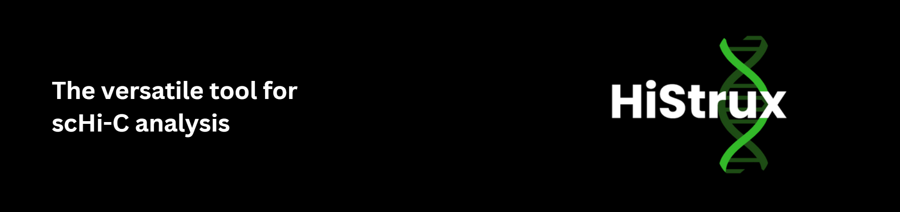

# HiStrux

**HiStrux** is a Python package designed for reconstructing chromatin structures from single-cell Hi-C (scHi-C) data. 
It integrates feature extraction, machine learning, and iterative molecular dynamics simulations to facilitate both 
data enrichment and 3D genome modeling.

- **Extract** a variety of metrics and structural features from scHi-C maps using the `eXtract` module.  
- **Classify** cells into interphase stages with a neural network-based model (`CycleSort`) and use this information for selective data pooling.  
- **Reconstruct** spatial chromatin organization with the `reConstruct` module, implementing iterative simulations built on top of HOOMD-blue.

 
HiStrux aims to bridge gaps between single-cell heterogeneity and richer multi-cell insights, providing an easy-to-use framework for more accurate 3D chromatin reconstructions.
